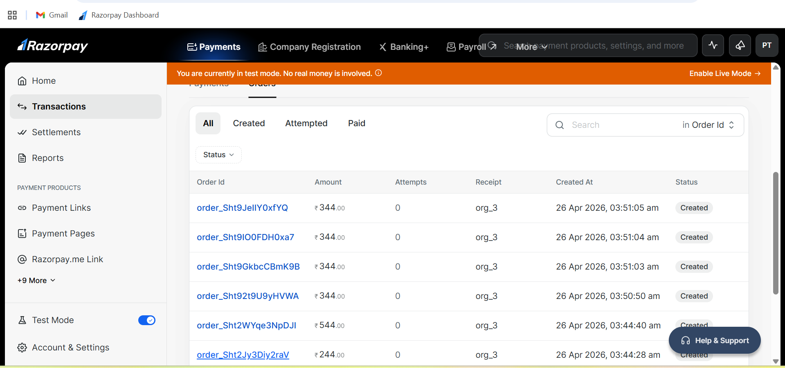
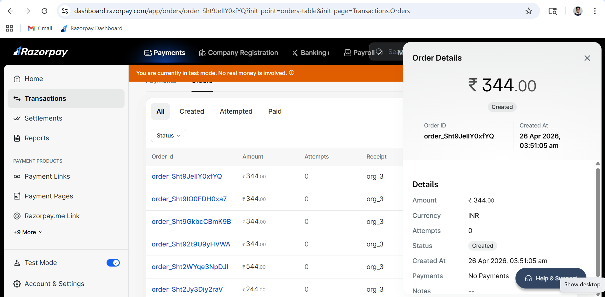

# Billing System (Spring Boot)

## 🚀 Features

* Organization & Seat Management
* Multiple Seat Types (BASIC, STANDARD, PREMIUM)
* Proration Billing (mid-cycle seat charges)
* Monthly Billing Engine
* Razorpay Test Mode Integration (Orders API)
* Billing History API
* Seat Breakdown API

---

## 🛠 Tech Stack

* Java 21
* Spring Boot
* MySQL
* Razorpay API (Test Mode)

---

## ▶️ How to Run

1. Clone the repository

2. Create MySQL database:

   CREATE DATABASE credx;

3. Update `application.properties`:

   razorpay.key=YOUR_KEY
   razorpay.secret=YOUR_SECRET

   spring.datasource.url=jdbc:mysql://localhost:3306/credx
   spring.datasource.username=root
   spring.datasource.password=yourpassword

4. Run the application:

   .\mvnw spring-boot:run

5. Server runs at:

   http://localhost:8081

---

## 💳 Razorpay Setup

1. Login to Razorpay Dashboard
2. Enable Test Mode
3. Go to Settings → API Keys
4. Generate Test Keys
5. Add keys in `application.properties`

---

## 🧠 Architecture

Controller → Service → Repository

* Controller: Handles API requests
* Service: Business logic (billing, proration, payments)
* Repository: Database interaction

---

## ⚖️ Tradeoffs & Decisions

* Used Razorpay Orders API instead of subscriptions for flexibility
* Treated order creation as payment success (backend-only flow)
* Simulated payment failure to test system reliability
* Kept design simple and modular for clarity

---

## 📦 APIs

POST /orgs
POST /orgs/{id}/seats
GET /orgs/{id}/seats
GET /orgs/{id}/seats/count
GET /orgs/{id}/billing/history

---

## 📂 Project Structure

/src → Spring Boot source code
/schema.sql → Database schema
/README.md → Documentation
/postman → API collection

---

## 🎯 Summary

This project implements a complete billing system with dynamic seat management, proration logic, and Razorpay test mode integration for payment simulation.

## Razorpay Test (Created Orders)

